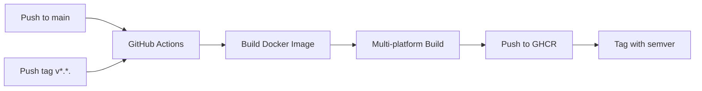

# Docker Setup Guide

This document covers the Docker build and GitHub Container Registry publishing pipeline.

> For **running** the container — Unraid install, updates, reverse-proxy exposure, and
> connecting Claude on the web — see **[README-DOCKER.md](README-DOCKER.md)**.

## Overview

The linkwarden-mcp-server is now available as a Docker image published to GitHub Container Registry (GHCR). This makes it easy for users to run the MCP server without needing to build from source.

## Files Created

### 1. Dockerfile (Multi-stage Build)

**Location:** `Dockerfile`

A multi-stage Dockerfile that:
- **Stage 1 (Builder)**: Uses `golang:1.26.5-alpine` to build the binary
  - Installs build dependencies (make, bash, git, oapi-codegen)
  - Generates SDK from OpenAPI specification
  - Builds a static binary with optimizations
- **Stage 2 (Final)**: Uses `alpine:latest` for minimal image size
  - Installs ca-certificates for HTTPS
  - Creates non-root user for security
  - Sets up environment variables
  - Entrypoint is the binary; the default command is `http`, overridable with `stdio`

**Image Size:** Approximately 20-30 MB (final Alpine image with binary)

### 2. .dockerignore

**Location:** `.dockerignore`

Optimizes Docker build context by excluding:
- Build artifacts (bin/, *.log)
- Git and GitHub files
- Documentation files
- Environment files
- IDE files
- macOS files

### 3. GitHub Actions Workflow

**Location:** `.github/workflows/docker-publish.yml`

Automates Docker image building and publishing with:
- **Triggers:**
  - Push to `main` branch (after PR merge)
  - Git tags matching `v*.*.*` pattern
- **Features:**
  - linux/amd64 builds (the Unraid target)
  - Automatic semantic versioning
  - GitHub Container Registry publishing
  - Build caching for faster builds
- **Permissions:**
  - Read repository contents
  - Write to GitHub packages

### 4. Updated Documentation

**Location:** `README.md`

Added comprehensive Docker usage instructions:
- Installation section with Docker as recommended method
- Usage examples for Claude Desktop
- Usage examples for Claude Code
- Generic MCP client usage
- Tag versioning explanation

## Using the Docker Image

### Pull the Image

```bash
# Latest version
docker pull ghcr.io/teejs/linkwarden-mcp-server:latest

# Specific version
docker pull ghcr.io/teejs/linkwarden-mcp-server:1.0.0
```

### Run the Image

```bash
docker run --rm -i \
  -e LINKWARDEN_BASE_URL="https://your-linkwarden-instance.com" \
  -e LINKWARDEN_TOKEN="your-api-token-here" \
  ghcr.io/teejs/linkwarden-mcp-server:latest
```

That starts the HTTP server. For stdio, append the subcommand:

```bash
docker run --rm -i \n  -e LINKWARDEN_BASE_URL="https://your-linkwarden-instance.com" \n  -e LINKWARDEN_TOKEN="your-api-token-here" \n  ghcr.io/teejs/linkwarden-mcp-server:latest stdio
```

### With Optional Configuration

```bash
docker run --rm -i \
  -e LINKWARDEN_BASE_URL="https://your-linkwarden-instance.com" \
  -e LINKWARDEN_TOKEN="your-api-token-here" \
  -e TOOLSETS="search,collection,link" \
  -e READ_ONLY="true" \
  ghcr.io/teejs/linkwarden-mcp-server:latest
```

## Building Locally

To build the Docker image locally:

```bash
# Build for your platform
docker build -t linkwarden-mcp-server:local .

# Build for multiple platforms
docker buildx build --platform linux/amd64 -t linkwarden-mcp-server:local .
```

## GitHub Actions Workflow

### Triggering a Build

The workflow automatically triggers when:

1. **Push to main branch:**
   ```bash
   git push origin main
   ```
   - Creates image tagged as `latest`
   - Creates image tagged with `sha-<short>`

2. **Create a version tag:**
   ```bash
   git tag v1.0.0
   git push origin v1.0.0
   ```
   - Creates images with tags: `v1.0.0`, `1.0.0`, `1.0`, `1`

### Semantic Versioning

The workflow follows semantic versioning (semver):

- **Major version tag** (e.g., `v1.0.0` → `1`): Always points to latest major version
- **Minor version tag** (e.g., `v1.0.0` → `1.0`): Always points to latest minor version
- **Patch version tag** (e.g., `v1.0.0` → `1.0.0`): Specific version
- **With 'v' prefix** (e.g., `v1.0.0`): Alternative format with prefix

### Viewing Build Status

1. Go to your GitHub repository
2. Navigate to "Actions" tab
3. Find "Build and Push Docker Image" workflow
4. View build logs and status

### Published Images

Images are published to:
```
ghcr.io/teejs/linkwarden-mcp-server
```

View published images at:
```
https://github.com/irfansofyana/linkwarden-mcp-server/pkgs/container/linkwarden-mcp-server
```

## Environment Variables

The Docker image accepts these environment variables:

| Variable | Required | Description | Default |
|----------|----------|-------------|---------|
| `LINKWARDEN_BASE_URL` | Yes | Linkwarden instance URL | - |
| `LINKWARDEN_TOKEN` | Yes | API authentication token | - |
| `TOOLSETS` | No | Comma-separated toolsets to enable | all |
| `READ_ONLY` | No | Enable read-only mode | `false` |
| `LOG_FILE` | No | Path to log file | - |

## Security Considerations

1. **Non-root User**: The container runs as user `mcpserver` (UID 1000) for security
2. **Static Binary**: CGO is disabled for a fully static binary
3. **Minimal Base Image**: Alpine Linux for reduced attack surface
4. **No Secrets in Image**: Secrets are passed via environment variables at runtime
5. **HTTPS Support**: ca-certificates included for secure API communication

## Troubleshooting

### Build Fails

If the GitHub Actions build fails:

1. Check the workflow logs in the Actions tab
2. Verify the Dockerfile builds locally:
   ```bash
   docker build -t test .
   ```
3. Check that SDK generation works:
   ```bash
   make generate-sdk
   ```

### Image Pull Fails

If you can't pull the image:

1. Ensure the image is public in GitHub package settings
2. Try authenticating with GitHub:
   ```bash
   echo $GITHUB_TOKEN | docker login ghcr.io -u USERNAME --password-stdin
   ```

### Container Exits Immediately

The container is designed for stdio communication. It will exit if not connected to an MCP client. This is expected behavior.

## Next Steps

1. **Test locally**: Build and test the Docker image locally
2. **Push to GitHub**: Commit and push the changes
3. **Create a release**: Tag a version to trigger the workflow
4. **Verify publication**: Check that the image is published to GHCR
5. **Update clients**: Update your MCP client configurations to use the Docker image

## CI/CD Workflow Summary



## Example: Creating Your First Release

```bash
# 1. Commit all changes
git add .
git commit -m "Add Docker support and GitHub Actions"

# 2. Push to main
git push origin main

# 3. Wait for workflow to complete (check Actions tab)

# 4. Create and push a version tag
git tag v1.0.0
git push origin v1.0.0

# 5. Check GHCR for published images
# Visit: https://github.com/irfansofyana?tab=packages
```

## Additional Resources

- [GitHub Container Registry Documentation](https://docs.github.com/en/packages/working-with-a-github-packages-registry/working-with-the-container-registry)
- [Docker Multi-stage Builds](https://docs.docker.com/build/building/multi-stage/)
- [GitHub Actions Documentation](https://docs.github.com/en/actions)
- [Semantic Versioning](https://semver.org/)
